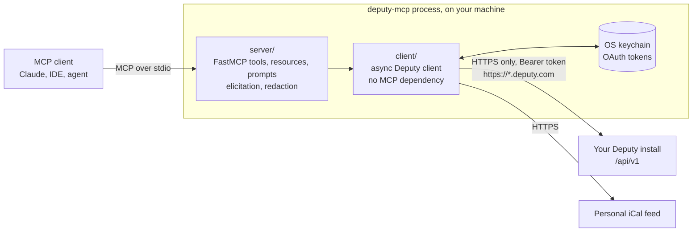

# Deputy MCP

<!-- mcp-name: io.github.augbastos/deputy-mcp -->

[](https://github.com/augbastos/Deputy-MCP/actions/workflows/ci.yml)
[](https://github.com/augbastos/Deputy-MCP/actions/workflows/security.yml)
[](pyproject.toml)
[](https://modelcontextprotocol.io)
[](LICENSE)

**An MCP server that lets AI agents read and, only when you allow it, act on your
[Deputy](https://www.deputy.com) roster, timesheets and shifts.**

Deputy is a workforce-scheduling platform: shifts, timesheets, clock-ins, availability.
Its data lives behind a web app and a REST API that an AI assistant cannot use on its
own. Deputy MCP is a local [Model Context Protocol](https://modelcontextprotocol.io)
server that gives Claude, or any MCP client, a small set of well-described tools over
that API. It runs on your machine, talks only to your own Deputy install, is read-only
unless you opt in, and works with an ordinary employee account, not just an admin one.

## What an agent can do with it

| You ask | The agent calls | Needs |
|---|---|---|
| "When do I work next?" | `deputy_next_shift` | any account |
| "What does my week look like?" | `deputy_get_my_roster` | any account |
| "How many hours did I work last week? Am I clocked in?" | `deputy_get_my_timesheets`, `deputy_whoami` | any account |
| "Who's on the floor right now?" | `deputy_who_is_working` | manager access |
| "Which open shifts are there on Saturday?" | `deputy_search_shifts` | manager access |
| "Take the open shift on Saturday." | `deputy_claim_open_shift`, **after you confirm it** | writes enabled |
| "Block out every Monday morning." | `deputy_set_unavailability` | writes enabled |

Against the bundled fictional demo install (`examples/mock_deputy.py`):

```text
> When do I work next?
### Next shift
_Times shown in Europe/Dublin._
- 2026-09-16 10:00 - 2026-09-16 18:00 | You | Front of House | 8.00h
```

## Safety model

Deputy MCP is software a language model drives, so the defaults assume the model will
sometimes pick the wrong tool or the wrong person.

- **Read-only by default.** Write tools are not registered unless the operator sets
  `DEPUTY_ALLOW_WRITES=true`, so a model cannot see them, let alone call them. The
  client refuses writes independently of the MCP layer.
- **A human approves the risky write.** Claiming an open shift skips Deputy's own
  approval step, so the tool shows the shift and asks the user through MCP
  elicitation first. Declining, cancelling, or a client that cannot ask means no write.
- **No silent guesses.** A name that matches several employees is answered with the
  list of matches, never with the first one.
- **Least surprise on permissions.** Self-service tools work for any employee; team
  tools say they need manager access and, on an employee account, return a short
  pointer to the tools that do work instead of a raw 403.
- **Nothing sensitive in answers.** Error bodies are redacted and truncated before a
  model sees them; employee JSON is projected to id, names, active flag, location and
  role; the personal calendar link is returned only by `deputy_get_my_calendar_url`.
- **Credentials stay put.** OAuth tokens live in the OS keychain; no token, secret or
  authorization code is logged, printed, or placed in an exception.

## Authentication

Pick one. The server resolves the mode from what is configured and fails closed, naming
every option, when nothing usable is set.

| Mode | For | Set | Surface |
|---|---|---|---|
| **API token** | Deputy admins | `DEPUTY_API_TOKEN`, `DEPUTY_BASE_URL` | All tools |
| **OAuth 2.0** | Any employee | `DEPUTY_OAUTH_CLIENT_ID`, `DEPUTY_OAUTH_CLIENT_SECRET`, then `deputy-mcp login` | All tools, limited by the account's own permissions |
| **iCal feed** | No API access at all | `DEPUTY_CALENDAR_URL` | Your own roster only: 4 read tools, no writes |

**API token.** In Deputy: *Business settings → Integrations → API access → New OAuth
Client → Get an Access Token*. Your base URL is the address you see when signed in,
for example `https://your-company.eu.deputy.com`.

**OAuth (no admin needed).** Deputy lets any user register a personal OAuth app:

1. Open <https://once.deputy.com/my/oauth_clients> and create an app with the redirect
   URI `http://localhost:8823/callback`.
2. Set `DEPUTY_OAUTH_CLIENT_ID` and `DEPUTY_OAUTH_CLIENT_SECRET`.
3. Run `deputy-mcp login` (add `--no-browser` on a headless machine). The browser
   consent returns an access/refresh token pair, stored in Windows Credential Manager,
   the macOS Keychain, or the Secret Service on Linux. The server refreshes it as it
   expires; `deputy-mcp logout` removes it.

Where no keychain exists (containers, headless hosts), set `DEPUTY_TOKEN_STORE` to a
file path to use a plaintext file store, created owner-only where the OS supports it.

**iCal feed.** In Deputy, open *My Schedule → Subscribe / Export to calendar* and copy
the link into `DEPUTY_CALENDAR_URL`. The link contains a private token: treat it as a
password.

## Architecture



- `client/` is a typed, async Deputy client (httpx + pydantic) with retries, a bounded
  read cache, pagination over Deputy's 500-record limit, and OAuth refresh. It has no
  MCP dependency and backs the CLI as well.
- `server/` adapts it to MCP with FastMCP 4: argument validation, tool descriptions a
  model can choose between, markdown or JSON output, and the confirmation gate.
- One renderer (`render.py`) serves both surfaces. The server shows times in the
  install's timezone; the CLI shows UTC, because it skips the extra company lookup.

## Install

Requires [uv](https://docs.astral.sh/uv/). Deputy MCP installs from this repository; it
is not published to PyPI yet.

### Claude Code

```bash
claude mcp add deputy \
  -e DEPUTY_API_TOKEN=your-deputy-token \
  -e DEPUTY_BASE_URL=https://your-company.eu.deputy.com \
  -- uvx --from git+https://github.com/augbastos/Deputy-MCP deputy-mcp
```

### Claude Desktop

Add to `claude_desktop_config.json`:

```json
{
  "mcpServers": {
    "deputy": {
      "command": "uvx",
      "args": ["--from", "git+https://github.com/augbastos/Deputy-MCP", "deputy-mcp"],
      "env": {
        "DEPUTY_OAUTH_CLIENT_ID": "your-client-id",
        "DEPUTY_OAUTH_CLIENT_SECRET": "your-client-secret"
      }
    }
  }
}
```

With OAuth, run `uvx --from git+https://github.com/augbastos/Deputy-MCP deputy-mcp login`
once, with the same two variables set, before starting the client.

### Other MCP clients

Run `uvx --from git+https://github.com/augbastos/Deputy-MCP deputy-mcp` as a stdio
server with the `DEPUTY_*` variables below. The server negotiates MCP `2026-07-28` with
current clients and the handshake revisions up to `2025-11-25` with older ones.

### Docker

```bash
docker build -t deputy-mcp .
docker run -i --rm --env-file .env deputy-mcp
```

The image runs as an unprivileged user and fails closed without credentials. A container
has no keychain, so for OAuth mount a volume and point `DEPUTY_TOKEN_STORE` at it; token
and iCal modes need nothing extra.

## Tools

Every tool takes `response_format`: `"markdown"` (default) or `"json"`. Dates are
ISO `YYYY-MM-DD`; times are shown in the install's timezone (UTC in iCal mode).

### Read tools — always registered

| Tool | Arguments | Access |
|---|---|---|
| `deputy_whoami` | — | any, iCal |
| `deputy_get_my_roster` | `start_date`, `end_date` | any, iCal |
| `deputy_next_shift` | `employee` (omit for yourself) | any, iCal; manager for others |
| `deputy_get_my_timesheets` | `start_date`, `end_date` | any |
| `deputy_get_my_colleagues` | `same_workplace_only` | any; no contact details |
| `deputy_get_my_calendar_url` | — | any, iCal |
| `deputy_get_areas` | — | any (lists your own areas without manager access) |
| `deputy_get_team_roster` | `date` or `start_date`/`end_date`, `area_id` | manager |
| `deputy_who_is_working` | `at` | manager |
| `deputy_get_employee_info` | `name_or_id` | manager |
| `deputy_search_shifts` | `employee`, `area_id`, `start_date`, `end_date`, `open_only`, `limit`, `offset` | manager |

In iCal mode only the four tools marked *iCal* are registered.

### Write tools — only with `DEPUTY_ALLOW_WRITES=true`

| Tool | Arguments | Behaviour |
|---|---|---|
| `deputy_claim_open_shift` | `shift_id` | Asks the user to confirm, then assigns the open shift to them |
| `deputy_request_shift_swap` | `shift_id`, `note` | Submits a swap for manager approval |
| `deputy_set_unavailability` | `start`, `end`, `reason`, `repeat` (RRULE) | Records a one-off or recurring block |
| `deputy_clock_in` | `area_id` | Starts a timesheet now |
| `deputy_clock_out` | `mealbreak_minutes` | Ends your running timesheet |

Write tools are annotated `readOnlyHint=false`, `destructiveHint=false`,
`idempotentHint=false`, so clients can treat them accordingly. None deletes anything.

### Resources and prompts

- `deputy://my/roster/this-week` and `deputy://my/roster/next-week` — your roster as
  markdown.
- `summarize_my_week` and `coverage_check` — prompt templates that chain the tools.

## Configuration

Values come from the environment, or from a dotenv file named by `DEPUTY_ENV_FILE` or
found in the working directory. Real environment variables win. A `.env` picked up
from the working directory cannot enable writes, allow custom hosts, or move the token
store: those three are honoured only from the environment or an explicitly named file.
See [`.env.example`](.env.example).

| Variable | Default | Purpose |
|---|---|---|
| `DEPUTY_API_TOKEN` | — | API token mode. |
| `DEPUTY_BASE_URL` | — | Install origin for API token mode, e.g. `https://your-company.eu.deputy.com`. |
| `DEPUTY_OAUTH_CLIENT_ID` | — | OAuth mode. |
| `DEPUTY_OAUTH_CLIENT_SECRET` | — | OAuth mode. |
| `DEPUTY_OAUTH_REDIRECT_PORT` | `8823` | Loopback port of the OAuth redirect URI. |
| `DEPUTY_TOKEN_STORE` | OS keychain | A file path selects the plaintext file store instead. |
| `DEPUTY_CALENDAR_URL` | — | iCal feed mode. |
| `DEPUTY_ALLOW_WRITES` | `false` | Register the write tools. |
| `DEPUTY_ALLOW_CUSTOM_HOST` | `false` | Allow an install host outside `*.deputy.com`. |
| `DEPUTY_CACHE_TTL` | `30` | Read cache lifetime in seconds; `0` disables it. |
| `DEPUTY_TIMEOUT` | `30` | Per-request timeout in seconds. |
| `DEPUTY_MAX_RETRIES` | `3` | Retries for idempotent requests on 429, 502–504 and timeouts. |
| `DEPUTY_ENV_FILE` | — | Dotenv file to load. |

## CLI

The same client ships as a command-line tool:

```bash
deputy-mcp whoami            # who the credentials belong to
deputy-mcp roster [--team]   # your roster, or everyone's with manager access
deputy-mcp next [--employee NAME_OR_ID]
deputy-mcp timesheets | who | areas
deputy-mcp login [--no-browser] | logout
```

Add `--json` for machine output. With no subcommand, `deputy-mcp` starts the MCP server.

## Engineering decisions

**The Deputy client knows nothing about MCP.** `client/` never imports `server/`, and a
test enforces that importing the server factory does not load FastMCP. API knowledge
(Deputy's QUERY DSL, the `/my/*` versus `/resource` permission split, envelope quirks)
lives in one place and is reusable from scripts and the CLI; the MCP layer owns only
what a model needs: descriptions, validation, rendering, confirmation.

**Write tools are absent, not disabled.** A tool a model can list is a tool it may try.
With writes off the tools are never registered, and the client's own gate refuses a
write even if the MCP layer were bypassed. With writes on, the one action that bypasses
a Deputy approval flow needs explicit human confirmation, implemented with MCP
elicitation on both protocol eras: `ctx.elicit()` on handshake connections, and an
`InputRequiredResult` whose approval is bound to the exact shift through FastMCP's
sealed `request_state` on `2026-07-28`. Routine self-service writes (clock in/out,
unavailability) and swap requests, which a manager still approves, deliberately do not
prompt: friction without protection trains people to click "yes".

**Retries follow idempotency, not status codes.** GETs and Deputy's read-only QUERY
POSTs retry on 429, 502–504 and timeouts with full-jitter exponential backoff that
honours `Retry-After`. Write POSTs are never retried on those: a timeout can hide a
mutation Deputy already applied, and replaying a clock-in creates a second timesheet.
The one replay is an OAuth request rejected with 401 before Deputy processed it, sent
again once after a token refresh.

**Hosts are an allowlist that fails closed.** The bearer token is only ever sent to
`https://*.deputy.com` unless `DEPUTY_ALLOW_CUSTOM_HOST` is set; a plain `http://` base
URL is refused. The same check covers the
install host returned by the OAuth token endpoint and the host recorded with a stored
token, before that token is used or refreshed, so neither a tampered response nor a
tampered token store can redirect credentials.

**Credentials are handled as data that must not escape.** Tokens and secrets are
pydantic `SecretStr` or redacted in `repr`. OAuth tokens live in the OS keychain through
`keyring`, with no custom cryptography; the plaintext file store is an explicit opt-in.
Keychain reads run in a worker thread, never on the event loop. Refresh follows
Deputy's rotating-refresh-token model: refreshes are serialised per process, the store
is re-read first so a token another process already rotated is adopted rather than spent
twice, and the new pair is persisted immediately. Every error
message the tools, resources and CLI render passes through one sanitiser that
removes bearer tokens, JWTs, OAuth codes, client secrets, emails, calendar-feed paths and
query strings while keeping status codes and Deputy's own wording.

**Protocol changes are absorbed by the framework.** The server uses FastMCP 4 and the
MCP Python SDK 2 rather than hand-rolled protocol code. The same tool definitions are
served over the stateless `2026-07-28` revision and the handshake-era revisions. Tests
check that both eras advertise identical tools and hide write tools when writes are off,
and exercise the open-shift confirmation on both.

**Tests are layered by what they can prove.**
- *Unit, client and server tests* mock Deputy at the HTTP layer with respx and run a real
  in-memory FastMCP client against the real server. They cover retries, pagination,
  OAuth refresh and rotation, keychain migration, redaction and tool error handling.
- *Agent-interface evals* (`pytest -m evals`) are deterministic checks of what a model
  sees: that "my next shift" reaches only self-service endpoints, that read tools never
  send a write, that write tools are absent when disabled, that ambiguous names never
  resolve silently, that each read tool's JSON object has exactly the keys its
  description documents, and that descriptions point only at tools registered in the
  same configuration, iCal mode included.
- *Live smoke tests* (`pytest -m live`) are read-only, opt-in, and never run in CI or
  with committed credentials.

## Quality gates

Every pull request to `main` runs: ruff lint and format, mypy `--strict`, pytest on
Linux (Python 3.11, 3.12, 3.13) and Windows (3.11, 3.13), a branch-coverage floor,
the agent evals, a package build with `twine check`, an install-and-run of the built
wheel, a CycloneDX SBOM, a container build, `pip-audit` over the full lockfile, CodeQL,
and a gitleaks scan of the entire history. Dependabot keeps the lockfile, pinned action
SHAs and the base image current.

## Status and validation

The self-service read paths (`/me`, `/my/roster`, `/my/timesheets`, `/my/colleague`),
OAuth login and the employee-level permission degradation were validated in July 2026
against a real Deputy install using an employee account. Manager-only reads
have only been observed returning their permission error at that level, and the write
tools have not been exercised against a live install. The OAuth refresh endpoint was
corrected in 0.2.0 to follow Deputy's documentation and has not yet been re-validated
live. Changes are listed in [CHANGELOG.md](CHANGELOG.md); planned work is in
[ROADMAP.md](ROADMAP.md).

Deputy MCP is an independent open-source project and is not affiliated with Deputy.

## Development

```bash
uv sync
uv run pytest                 # unit, client, server and agent evals (no network)
uv run ruff check . && uv run ruff format --check .
uv run mypy
```

The client works on its own:

```python
import asyncio

from deputy_mcp.client import DeputyClient


async def main() -> None:
    async with DeputyClient.from_env() as deputy:
        print(await deputy.next_shift())


asyncio.run(main())
```

See [CONTRIBUTING.md](CONTRIBUTING.md) for the layout and conventions, and
[SECURITY.md](SECURITY.md) to report a vulnerability.

## License

[MIT](LICENSE)
